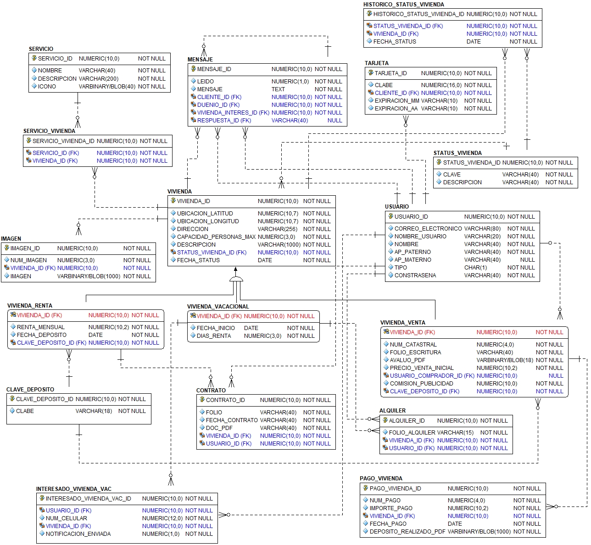

# **Base** de datos

## Proyecto final: Global Home

```shell
@author: Francisco Pablo Rodrigo
@author: Flores García Karina
@Fecha : 23/11/12

HTML 5 | js | css3 | bootstrap v4.1 | laravel 6.5.0 | php7.3 | laravel/installer2.1
ORACLE 18g DB
```

### Caso de estudio

Global Home es una empresa que cuenta con un sitio Web destinado a la renta y/o venta de viviendas ya sea por periodos largos o simplemente para propósitos de vacaciones. Se requiere realizar la construcción de una base de datos relacional que permita implementar las siguientes funcionalidades tanto en su sitio web como en su aplicación móvil.

[Ver todo el caso de estudio](CASOESTUDIO.md)

### Modelo relacional



### Para desarrolladores

Se realizará la aplicación web y un webservice (posiblemente) utilizando un framework de php, *Laravel*.

#### Licencia

Este proyecto esta licenciado aún no tiene una licencia pero se encontrará  [aquí](../LICENSE.md)

#### Contribuciones

La guía para contribuir al proyecto se encuentre [aquí](../CONTRIBUTING)

### Construcción del modelo relacional

#### Script s-01-usuarios.sql

Los usuarios creados son 

* ff_proy_admin
* ff_proy_invitado

#### Script s-02-entidades.sql

| Issue           | Entidad                 | Atributo                       |
| --------------- | ----------------------- | ------------------------------ |
| **Default**    | Vivienda                | fecha_status default sysdate   |
| **Default**    | Mensaje                 | leido default 0                |
| **Default**    | Contrato                | fecha_contrato default sysdate |
| **Default**    | Interesado_vivienda_vac | notificacion_enviada default   |
| **Columna virtual** |                         |                                |
| **Unique** | imagen        | num_imagen,vivienda_id |
| **Unique** | usuario       | email                  |
| **Unique** | pago_vivienda | num_pago, vivienda_id  |
| **Check**  | tarjeta       | expiracion_mm          |

##### Atributos calculados
* Para las viviendas en venta es posible realizar hasta 240 pagos, para cada pago se calcularan los días que faltan para que este se realice (fechaPago-fechaActual), cuando falten al menos 5 días para pagar se le enviará una notificación al usuario para recordarle que debe realizar su depósito.
* Para las tarjetas que los usuarios registren de debera calcular los días que faltan para que dicha tarjeta expire (fechaExpiración-fechaActual), cuando falten al menos 15 días para que expire se le enviará un recordatorio a usuario para que actualice su forma de pago.
  

#### Script s-05-secuencias.sql

De las 18 entidades se generaron 15 secuencias, vivienda, vivienda_renta, vivienda_vacacional y vivienda_venta comparten la secuencia.

#### Script s-06-indices.sql

#### Script s-09-carga-inicial.sql

Los datos se generan de forma random por medio *mockaroo*

|      | Entidad                   | Cantidad de datos generados |
| ---- | ------------------------- | --------------------------- |
| 1    | vivienda                  | 100                         |
| 2    | vivienda_renta            | 30                          |
| 3    | vivienda_vacacional       | 30                          |
| 4    | status_vivienda           | 6                           |
| 5    | historico_status_vivienda | 100                         |
| 6    | imagen                    | 25                          |
| 7    | servicio                  | 20                          |
| 8    | servicio_vivienda         | 100                         |
| 9    | usuario                   | 100                         |
| 10   | tarjeta                   | 50                          |
| 11   | mensaje                   | 50                          |
| 12   | clave_deposito            | 50                          |
| 13   | vivienda_renta_clave_dep  | 30                          |
| 14   | vivienda_venta            | 50                          |
| 15   | pago_vivienda             | 150                         |
| 16   | alquiler                  | 15                          |
| 17   | contrato                  | 15                          |
| 18   | interesado_vivienda_vac   | 30                          |

### Requerimientos propuestos

* **En las siguientes reglas de negocios se hacen uso de los requerimiento 03 a 19, excepto 05, 06, 09**

Periodicamente a la empresa *Global Home*  le llega información de nuevas viviendas que deben incorporar en su catálogo de viviendas y sus correspondientes tipos. Dicha información llega a través de un archivo de *texto separado por compas (CSV)*, por lo cual se requiere hacer uso de una **tabla externa [04,1]** que cargue la información de las viviendas. Dicha información incluir lo siguiente:

* ubicacion_longitud
* ubicacion_latitud
* direccion
* capacidad_personas_max
* descripcion
* renta_mensual
* dia_deposito
* fecha_inicio
* dias_renta

Se deberá generar un **procedimiento almacenado [13,1]** que PARA CADA "REGISTRO" (**cursor [19,1]**) verifique la integridad de los datos de la tabla externa antes de que sean insertados en la jerarquía correspondiente.

Tener cuidado con el tipo de vivienda, dado que la longitud del atributo es de uno

* "VIVIENDA_RENTA" => R
* "VIVIENDA_VACACIONAL" => V
* "VIVIENDA_VENTA" => S (venta en inglés, *sell*)

Las viviendas que NO hayan cumplido con los criterios para ser insertadas en la jerarquía se insertarán en una **tabla temporal [03,1]** con la finalidad de informar al usuario final (app web) las incidencias que debe corregir.

Para conservar la seguridad de los datos *críticos* se crearán las siguientes **vistas**:

1. **La vista [08,1]** será una vista casi identica a la entidad usuario excepto que no tendrá el campo de la contraseña.

2. Para el caso de las viviendas en venta es importante no mostrar datos delicados, los cuales son

   * avaluo_pdf

   * comision_publicidad

   * clave_deposito

   Para lo cual será uso de la **vista [08,2]**

Por otra parte, global home desea conocer todas las viviendas de renta o vacacional que tengan más de 5 servicios, adicional a ello se deberán mostrar los contratos o alquileres si los hay, de esta manera el usuario administrador podrá conocer las viviendas que actualmente le estan generando ingresos, por la complejidad de la consulta se decide emplear una **vista [08,3]**.

Al registrar un contrato o el alquiler se debe autogenerar el folio por medio de una **funcion [15,1]** a partir de los siguientes datos.

* "CON" o "ALQ" para contrato o alquiler, según se el caso. En caso de este registrada en ambas se emplean los caracteres "COA".
* El identificador de la vivienda.
* El identificador del usuario.
* La fecha de registro

En caso de que los folios ya se hayan insertado, crear un **procedimiento almacenado [13,2]** que los corrija en caso de ser necesario.

Para el caso de los mensajes entre el dueño y un posible cliente se requiere cuidar la integridad de los datos ya que No se permite que:

* Un cliente se pueda responder así mismo, es decir, cliente_id != duenio_id
* Tampoco es válido que la respuesta se la misma que el mensaje, es decir, mensaje_id != respuesta_id

Los requerimientos anteriores deberán ser válidados mediante un **trigger [11,1]**

Para poder realizar la *carga de datos de prueba* se debe deshabilitar el constraint not null de todos los datos de tipo blob ya que la aplicación no genera dicho tipo de dato. Una vez hecha la inserción de datos, se debe descargar imagenes o pdf random e insertarlos en cada uno de los campos donde corresponda. Finalmente, se debe habilitar el constraint para no permitir nulos.

1. No se puede insertar en **vivienda_venta** si ya se inserto en **vivienda_vacacional** o en **vivienda_renta**.
2. Cuando **una vivienda para vacacionar** este disponible, se enviarará un mensaje a todos los usuarios interesados.
3. Entre **vivienda vacacional** y **usuario** se genera una tabla **alquiler**, si el usuario insertado en alquiler no tiene tarjeta de crédito registrada, se le solicitará ingresar una.
4. Validar en **pago_vivienda** que solo se pueden hacer 240 insert's.

### To do

* [ ] **Agregar cardinalidades** 
* [ ] Revisar cómo hacer la conexión de la DB con laravel.
* [ ] Revisar que módulo se implementará en *laravel* para hacer las vista de dicho módulo.
* [ ] Verificar que la tarjeta ingresada sea válida (fecha de expiración).
* [ ] Cambiar doc_pdf de varchar a blob porque se trata de un documento
### Dudas

1. ¿Se deben almacenar las fechas de conformidad? NO
2. ¿La notificación es una entidad? No lo es
3. ¿Cómo implementar tres sinónimos públicos?
4. ¿A que se refiere con los dos caracteres de los sinónimos (punto 7 de los req.)