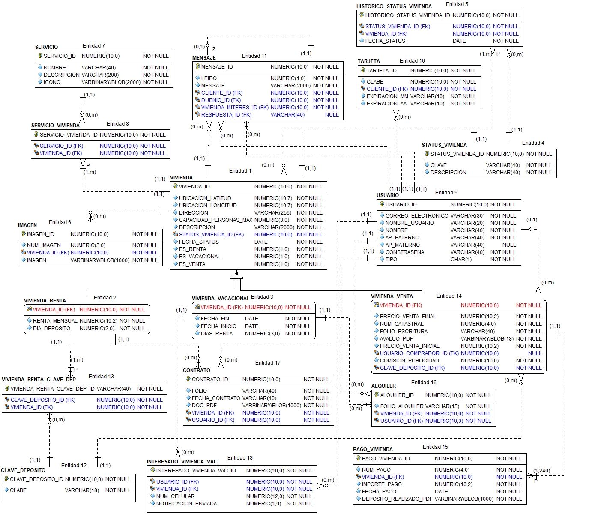

# Base de datos

## Proyecto final: Global Home

```shell
@author: Francisco Pablo Rodrigo
@author: Flores García Karina
@Fecha : 23/11/12

HTML 5 | js | css3 | bootstrap v4.1 | laravel 6.5.0 | php7.3 | laravel/installer2.1
ORACLE 18g DB
```

### Caso de estudio

Global Home es una empresa que cuenta con un sitio Web destinado a la renta y/o venta de viviendas ya sea por periodos largos o simplemente para propósitos de vacaciones. Se requiere realizar la construcción de una base de datos relacional que permita implementar las siguientes funcionalidades tanto en su sitio web como en su aplicación móvil.

[Ver todo el caso de estudio](CASOESTUDIO.md)

### Modelo relacional



### Para desarrolladores

Se realizará la aplicación web y un webservice (posiblemente) utilizando un framework de php, *Laravel*.

#### Licencia

Este proyecto esta licenciado aún no tiene una licencia pero se encontrará  [aquí](LICENSE)

#### Contribuciones

La guía para contribuir al proyecto se encuentre [aquí](CONTRIBUTING)

### Dudas

1. ¿Se deben almacenar las fechas de conformidad? NO
2. ¿La notificación es una entidad? No lo es

### Elementos del modelo

#### Uso de default

#### Propuesta de tabla virtual

#### Constraints

##### UNIQUE

1. imagen (num_imagen,vivienda_id)
2. usuario(email)
3. pago_vivienda(num_pago,vivienda_id)

#### Triggers

1. No se puede insertar en **vivienda_venta** si ya se inserto en **vivienda_vacacional** o en **vivienda_renta**.
2. Cuando **una vivienda para vacacionar** este disponible, se enviarará un mensaje a todos los usuarios interesados.
3. Entre **vivienda vacacionar** y **usuario** se genera una tabla **alquiler**, si el usuario insertado en alquiler no tiene tarjeta de crédito registrada, se le solicitará ingresar una.
4. Validar en **pago_vivienda** que solo se pueden hacer 240 insert's.

### Todo

* [ ] Agregar cardinalidades y corregir notación Crow's foot, recomiendo cambiar a IDEF1X
* [ ] Checar donde se podrían implementar posibles vistas.
* [ ] Identificar triggers.
* [ ] Revisar cómo hacer la conexión de la DB con laravel.
* [ ] Revisar que módulo se implementará en *laravel* para hacer las vista de dicho módulo.